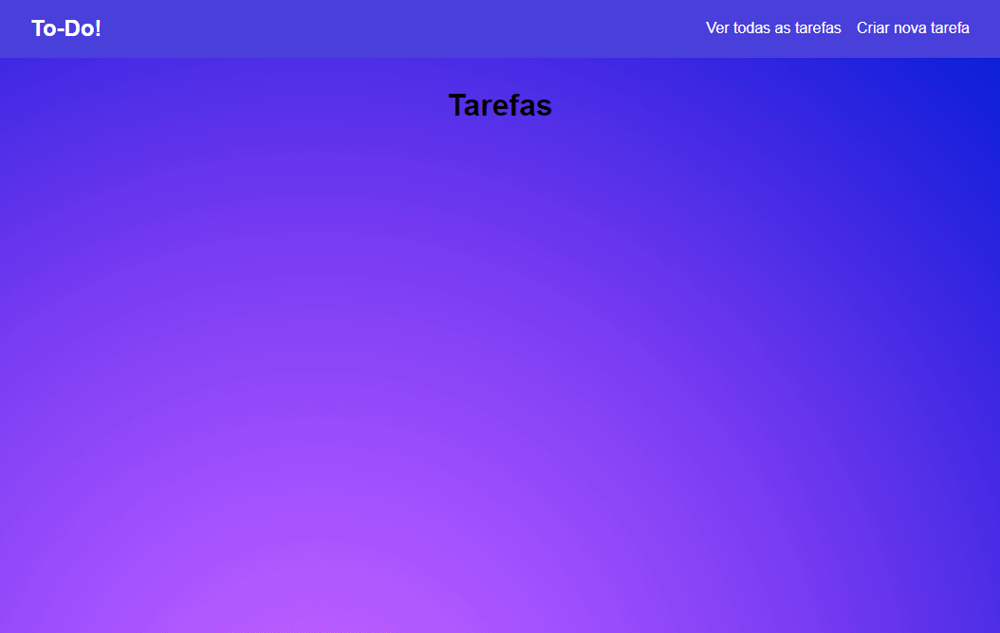

 

    

  <h3 align="center">To-Do List com NodeJS, Sequelize e PostgreSQL</h3>
  
  

     To-do List
      

  <a href="#sobre"> Sobre </a> |
  <a href="#conhecimentos-praticados"> Conhecimentos praticados </a> |
  <a href="#rotas-da-aplicação"> Rotas da aplicação </a> |
  <a href="#tecnologias-utilizadas"> Tecnologias utilizadas </a>      
        
     
    <h1 align="center">
    
 </h1>
  

# Sobre
O objetivo do projeto foi criar uma To-Do List, com a finalidade de colocar em prática os meus conhecimentos no padrão MVC e aprender melhor sobre a responsabilidade das camadas Model, View e Controller.

Na aplicação é possível cadastrar tarefas com nome e descrição, marcar as tarefas como concluídas, atualizar as tarefas (nome e descrição) e deletar tarefas.

# Conhecimentos Praticados
✔ NodeJs  
✔ Express  
✔ Sequelize  
✔ CRUD com Sequelize  
✔ Padrão MVC

# Rotas da aplicação:
<b>[GET] </b> /tasks/ : A rota deve retornar todas as tarefas cadastradas.  

<b> [GET] </b> /tasks/:id : A rota deve retornar todas as informações da tarefa referente ao ID recebido como parâmetro na URL.  

<b>[GET] </b> /tasks/add : A rota deve exibir a formulário de cadastro de tarefas.  

<b>[POST] </b> /tasks/add : A rota deve salvar as informaçaões da tarefa no banco de dados com os dados recebidos no corpo da requisição.  

<b>[GET] </b> /tasks/edit/:id : A rota deve exibir o formulário de edição com as informações da tarefa que será editada referente ao ID recebido como parâmetro na URL.  

<b>[POST] </b> /tasks/edit : A rota deve salvar as informações atualizadas da tarefa no banco de dados.  

<b>[POST] </b> /tasks/updatestatus: A rota deve atualizar o status da tarefa.  

<b>[POST] </b> /tasks/remove : A rota deve deletar uma tarefa do banco de dados baseado no ID.  

# Tecnologias utilizadas: 

   

---
**Desenvolvido  por [Bruno Andreotti](www.linkedin.com/in/bruno-andreotti/).** 